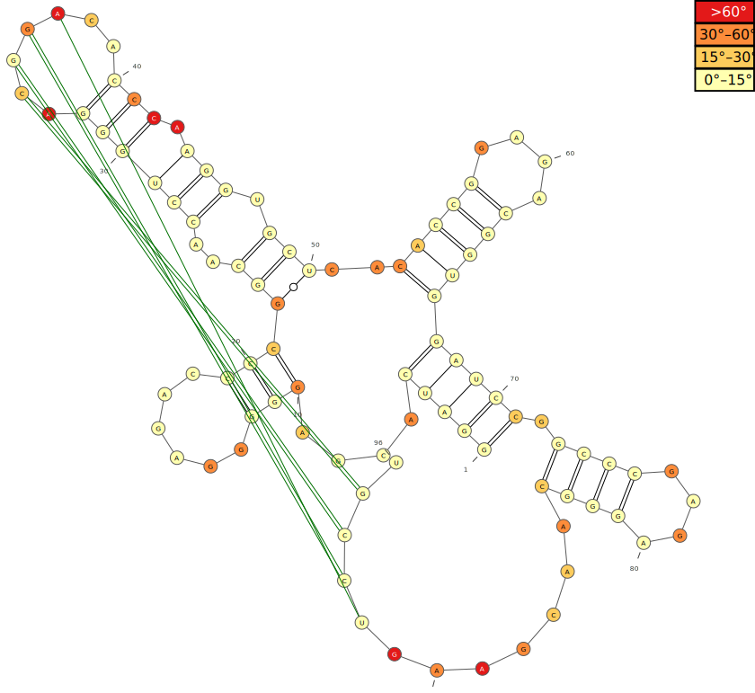

# Mean of Circular Quantities (MCQ). Command-line tools

Mean of Circular Quantities (MCQ) is a dissimilarity measure useful in comparison of 3D protein and/or RNA structures. It calculates an average difference between corresponding torsion angle values (rotations around bonds). More information can be found in:

> Tomasz Zok, Mariusz Popenda, and Marta Szachniuk. 2014. "MCQ4Structures to Compute Similarity of Molecule Structures." Central European Journal of Operations Research 22(3):457–73.

> Jakub Wiedemann, Tomasz Zok, Maciej Milostan, and Marta Szachniuk. 2017. "LCS-TA to Identify Similar Fragments in RNA 3D Structures." BMC Bioinformatics 18(1):456.

This project contains command-line tools to compare RNA 3D structures.

## Usage

### `mcq-local`

```bash
$ ./mcq-local

usage: mcq-local [-a <arg>] [-M <arg>] [-n <arg>] -t <arg> [-T <arg>]

 -a,--angles <arg>             Torsion angle types (separated by comma without
                               space), select from:
                               ALPHA,BETA,GAMMA,DELTA,EPSILON,ZETA,NU0,NU1,NU2
                               ,NU3,NU4,ETA,THETA,ETA_PRIM,THETA_PRIM,CHI,PSEU
                               DOPHASE_PUCKER. Default is:
                               ALPHA,BETA,GAMMA,DELTA,EPSILON,ZETA,CHI
 -M,--selection-model <arg>    Selection query for 3D RNA model
 -n,--names <arg>              Model names to be saved in output files
                               (separated by comma without space)
 -t,--target <arg>             Path to PDB file of the native 3D RNA target
 -T,--selection-target <arg>   Selection query for native 3D RNA target

selection query syntax is CHAIN:RESNUM-ICODE:COUNT e.g. A:1:5 means a
selection of 5 residues starting with residue number 1 in chain A
```

`mcq-local` is a tool which compares a set of 3D structures against a reference target. User can select a set of torsion angle types to be considered in the comparison process. Both the target and models can be aligned using selection queries.

The results are:

- Ranking of models with respect to MCQ value
- Detailed data about dissimilarity for each residue in every model
- Visualization of secondary structure with color-coded dissimilarities in each residue for every model

```bash
$ ./mcq-local -t /tmp/rp13/13_0_solution_4XW7_rpr.pdb -T A:1:45 -M A:1:45 /tmp/rp13/13_{A,B,D,X}*.pdb

Partial results are available in: /tmp/bbbfa598-4adf-42b5-b457-fd89601fbb59
13_Das_2_rpr.pdb 19.07
13_Bujnicki_5_rpr.pdb 19.27
13_Bujnicki_8_rpr.pdb 19.60
...

$ ls -l /tmp/bbbfa598-4adf-42b5-b457-fd89601fbb59/
drwxr-xr-x 2 tzok tzok   100 03-14 14:43 13_Bujnicki_5_rpr
drwxr-xr-x 2 tzok tzok   100 03-14 14:43 13_Bujnicki_8_rpr
drwxr-xr-x 2 tzok tzok   100 03-14 14:43 13_Das_2_rpr
-rw-r--r-- 1 tzok tzok 39147 03-14 14:43 table.csv
...
```

Each directory with model name contains visualization and details about angular dissimilarity and MCQ for each residue.



A helper script `colorbar.py` can be used to produce colorbars from generated `table.csv` using `./colorbar.py -i table.csv`.


### `mcq-lcs`

```bash
$ ./mcq-lcs

usage: mcq-lcs [-M <arg>] -t <arg> [-T <arg>] -v <arg>

 -M,--selection-model <arg>       Selection query for 3D RNA model
 -t,--target <arg>                Path to PDB file of the native 3D RNA target
 -T,--selection-target <arg>      Selection query for native 3D RNA target
 -v,--mcq-threshold-value <arg>   Value of MCQ threshold in degrees

selection query syntax is CHAIN:RESNUM-ICODE:COUNT e.g. A:1:5 means a
selection of 5 residues starting with residue number 1 in chain A
```

`mcq-lcs` is a tool to find the longest continuous segment which is dissimilar up to a cerain MCQ threshold.

The result is a set of information about found segments alignment: size, coverage and nucleotide positions in the chains.

```bash
$ ./mcq-lcs -t /tmp/rp13/13_0_solution_4XW7_rpr.pdb /tmp/rp13/13_Das_2_rpr.pdb -v 15

MCQ value: 15°
Number of residues: 19
Coverage: 31.667% 
Target name: 13_0_solution_4XW7_rpr
First target residue: A.U7
Last target residue: A.G25
Model name: 13_Das_2_rpr
First model residue: A.A27
Last model residue: A.C45
```

### `mcq-global`

```bash
$ ./mcq-global 

usage: mcq-global [-a <arg>] [-M <arg>]

 -a,--angles <arg>            Torsion angle types (separated by comma without
                              space), select from:
                              ALPHA,BETA,GAMMA,DELTA,EPSILON,ZETA,NU0,NU1,NU2,
                              NU3,NU4,ETA,THETA,ETA_PRIM,THETA_PRIM,CHI,PSEUDO
                              PHASE_PUCKER. Default is:
                              ALPHA,BETA,GAMMA,DELTA,EPSILON,ZETA,CHI
 -M,--selection-model <arg>   Selection query for 3D RNA model

selection query syntax is CHAIN:RESNUM-ICODE:COUNT e.g. A:1:5 means a
selection of 5 residues starting with residue number 1 in chain A
```

`mcq-global` tool is useful for comparison of multiple 3D structures without a reference one. A single MCQ value is computed for each pair of 3D structures. The selection of torsion angle types to be considered in the comparison can be changed using `--angles` switch. By default, the alignment of structures is done automatically, but user can provide a selection query to compute just a fragment.

The results are:

- Distance matrix
- Clustering (k-medoids)
- Visualization

```bash
$ ./mcq-global /tmp/rp13/*.pdb

Comparing... 100% │████████████████████████████████│ 1081/1081 (0:00:09 / 0:00:00)
Results available in: /tmp/f3610dda-feec-460e-9cd4-ecf1c1b8466c

$ ls -l /tmp/f3610dda-feec-460e-9cd4-ecf1c1b8466c/
-rw-r--r-- 1 tzok tzok  5614 03-14 14:31 clustering.svg
-rw-r--r-- 1 tzok tzok   981 03-14 14:31 clustering.txt
-rw-r--r-- 1 tzok tzok 41926 03-14 14:31 matrix.csv
```


### `mcq-print`

```bash
$ ./mcq-print

usage: mcq-print [-T <arg>]

 -T,--selection-target <arg>   Selection query for native 3D RNA target

selection query syntax is CHAIN:RESNUM-ICODE:COUNT e.g. A:1:5 means a
selection of 5 residues starting with residue number 1 in chain A
```

`mcq-print` is a utility tool to print out values of torsion angles in a TSV format.

```bash
$ ./mcq-print /tmp/rp13/13_0_solution_4XW7_rpr.pdb

Chain   ResNum  iCode   Name    alpha   beta        gamma   delta   epsilon     zeta    chi
A       1       -       G       -       -164.167    58.239  77.868  -153.691    -67.832 -170.106
A       2       -       G       -74.196 -178.465    57.158  79.161  -148.81     -69.172 -168.967
A       3       -       G       -63.156  173.711    54.802  76.679  -144.103    -80.547 -165.204
...
```
